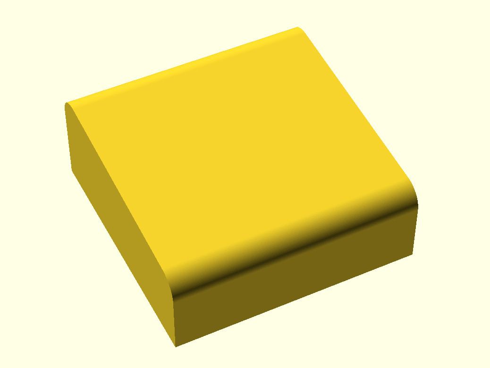

# Case
This is a 3D design of a case for devices that are used horizontaly and have controlls and displays on the top. In other words any device that is used by standing on the floor or standing on the table such as guitar pedals, synthisizers, midi controllers etc.

It is developed using openscad and therefore easily customzable programaticaly for adding additional items or for cutting the holes for attaching additional hardware and displays.

Case dimensions, wall thickenes and radius of front and end edge slope can be set.

##Main parts

Case consist of top and bottom parts.
