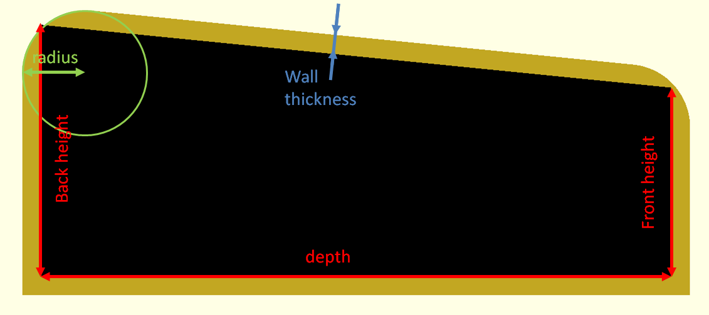
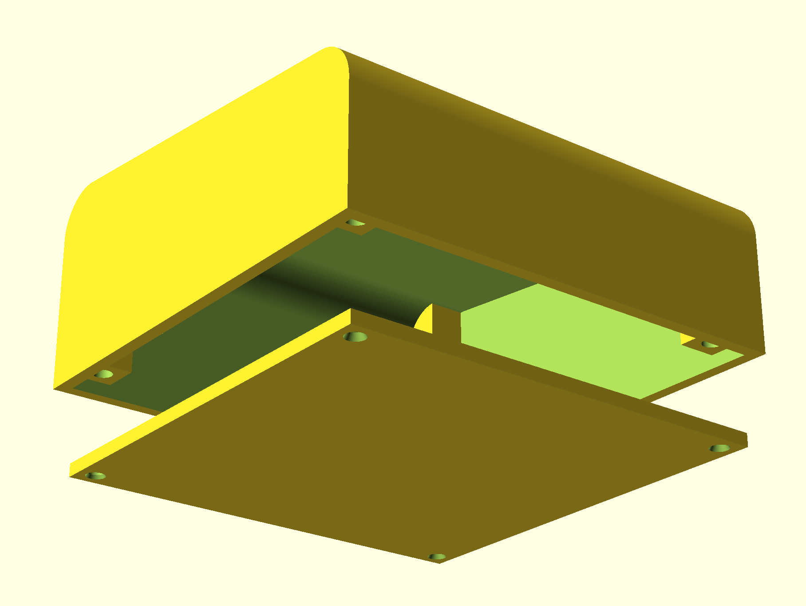

# Case
This is a 3D design of a case for devices that are used horizontally and have controls and displays on the top. In other words any device that is used by standing on the floor or standing on the table such as guitar pedals, synthesizers, midi controllers etc.

It is developed using free software called OpenScad and therefore easily customizable programmatically for adding additional items or for cutting the holes for attaching additional hardware and displays.

## Case configurable parameters

The following case parameters can be configured:
- dimensions such as depth, width, back and front height
- wall thickness
- radius for front and end edge slope

Internal dimensions are used because the main purpose of the case is for enclosing something inside it. Case outside dimensions can be calculated using the following rules:
- outside width is width + 2 * wall thickness (left and right wall thickness)
- outside depth  is depth + 2 * wall thickness (front and rear  wall thickness)
- outside back height is back height + wall thickness + wall thickness /sin(90-slope angle)
- outside front height is front height + wall thickness + wall thickness /sin(90-slope angle)

where slope angle is atan(height difference/depth).

NOTE: top of internal back and front will be trimmed by the slope depending on the circle radius.

## Main parts

Case consist of top and bottom parts.

### Top part

Top part is made by module case_base that is cut by module case_cut. 

